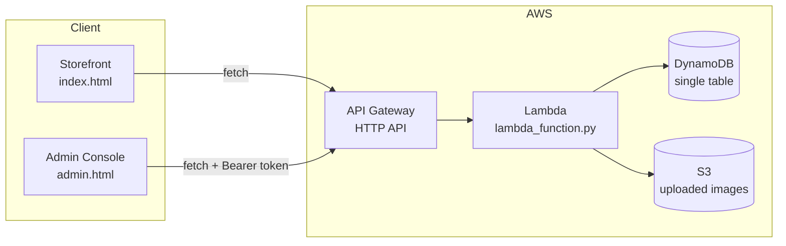

# 🔥 Tandoor & Trail — Online Food Ordering Platform

A full-stack food ordering system: a customer-facing storefront with live order tracking and accounts, a staff admin console, and a serverless AWS backend (Lambda + API Gateway + DynamoDB + S3).

<!--
  Add your own screenshots by dropping images into docs/screenshots/
  using the exact filenames below, or update the paths to match yours.
-->


---

## 📖 Table of Contents

- [Features](#-features)
- [Screenshots](#-screenshots)
- [Architecture](#-architecture)
- [Tech Stack](#-tech-stack)
- [Project Structure](#-project-structure)
- [Getting Started](#-getting-started)
  - [1. Backend (AWS Lambda)](#1-backend-aws-lambda)
  - [2. Frontend (static hosting / EC2)](#2-frontend-static-hosting--ec2)
- [API Reference](#-api-reference)
- [Security Notes](#-security-notes)
- [Known Limitations / Roadmap](#-known-limitations--roadmap)
- [License](#-license)

---

## ✨ Features

**Customer storefront**
- Browse menu with category filters and live search
- Cart, checkout, and real order placement
- "Recreate a Dish" — upload a reference photo for a custom order request
- Guest order tracking by Order ID or phone number, no account required
- Customer accounts — register/login, personal dashboard with order history + stats
- Self-service order cancellation (while the order is still `Pending`/`Accepted`)
- Checkout auto-fills from a logged-in account

**Admin console**
- Backend-verified passcode login (signed session token, not a hardcoded frontend value)
- Live dashboard: order counts by status, revenue, today's orders, last-5-minutes feed
- Month-by-month revenue lookup
- Full order management: filter/search, view detail + status history, update status, delete
- Menu management with real image upload
- Read-only customer list

---

## 📸 Screenshots

<!-- Replace these placeholders with real screenshots. Recommended size: 1280×800 or similar. -->

| Storefront | Menu & Cart |
|---|---|
| 
 | 
 |

| Order Tracking | Customer Account |
|---|---|
| 
 | 
 |

| Admin Overview | Admin Orders |
|---|---|
| 
 | 
 |

> 💡 To add these: create a `docs/screenshots/` folder in your repo and drop in PNGs with the filenames above — the images will render automatically on GitHub.

---

## 🏗 Architecture



- **Single-table DynamoDB design** — orders, menu items, customers, and status-history entries all live in one table, distinguished by a `orderPId` prefix (`ORDER#`, `MENU#`, `CUSTOMER#`, `STATUS#`).
- **Two auth scopes, one signing secret** — admin sessions (8-hour, `sessionStorage`) and customer sessions (30-day, `localStorage`) use the same HMAC signing mechanism but are cryptographically scoped so a token minted for one can't be replayed against the other.
- **Public vs. protected routes** — menu browsing, placing orders, uploads, and guest order tracking are public by design; admin analytics/order-management and the customer dashboard require a valid bearer token.

---

## 🛠 Tech Stack

| Layer | Technology |
|---|---|
| Frontend | Vanilla HTML / CSS / JavaScript (no build step, no framework) |
| Backend | Python 3 on AWS Lambda |
| API | Amazon API Gateway (HTTP API) |
| Database | Amazon DynamoDB |
| File storage | Amazon S3 (dish photos, custom-order reference images) |
| Auth | Custom HMAC-signed session tokens (no external auth provider) |

---

## 📁 Project Structure

```
.
├── index.html              # Customer storefront
├── admin.html               # Staff admin console
├── style.css                 # Shared stylesheet (both pages)
├── script.js                # Storefront logic
├── admin.js                 # Admin console logic
├── config.js                 # Shared config — API URL, feature flags
├── lambda_function.py       # Backend — single Lambda, all routes
└── docs/
    └── screenshots/          # Screenshots referenced in this README
```

---

## 🚀 Getting Started

### 1. Backend (AWS Lambda)

1. Create a DynamoDB table and an S3 bucket (or use existing ones).
2. Deploy `lambda_function.py` to a Lambda function.
3. Set these environment variables on the Lambda:

   | Variable | Description |
   |---|---|
   | `TABLE_NAME` | Your DynamoDB table name |
   | `BUCKET_NAME` | Your S3 bucket name |
   | `ADMIN_PASSCODE` | Passcode staff use to log into the admin console |
   | `APP_SECRET` | Long random string that signs session tokens — generate with `python3 -c "import secrets; print(secrets.token_hex(32))"` |

4. Put this Lambda behind an API Gateway **HTTP API**. Either enable CORS at the API level (`Access-Control-Allow-Origin: *`, `Allow-Headers: Content-Type,Authorization`, `Allow-Methods: *`) or route every method — including `OPTIONS` — to the Lambda so its own CORS headers apply.
5. **Redeploy the API stage** after adding routes — a route only works once deployed, even if the Lambda already handles it in code.

### 2. Frontend (static hosting / EC2)

1. Open `config.js` and set:
   ```js
   const CONFIG = {
     API_BASE: "https://your-api-id.execute-api.your-region.amazonaws.com",
     DEMO_MODE_FALLBACK: false
   };
   ```
2. Upload all frontend files to your web root (EC2, S3 static hosting, Netlify, wherever) — **all files must be in the same folder**, since `admin.html`/`index.html` both load `config.js`, `style.css`, and their respective JS file relatively.
3. Visit `index.html` for the storefront and `admin.html` for the admin console.

> ⚠️ Open these through an actual web server (`http://...`), not by double-clicking the file (`file://...`). Browsers treat `file://` pages as locked-down unique origins, and cross-origin API calls will silently fail with `Failed to fetch` even if your backend is configured correctly.

---

## 📡 API Reference

| Method | Route | Auth | Description |
|---|---|---|---|
| `POST` | `/orders` | Public | Place an order |
| `GET` | `/orders/{id}` | Public | Track an order by ID |
| `GET` | `/customer/orders?phone=` | Public | Track orders by phone |
| `GET` | `/history/{id}` | Public | Order status history |
| `PUT` | `/orders/{id}/cancel` | Public (phone-verified) | Cancel a `Pending`/`Accepted` order |
| `POST` | `/upload` | Public | Upload an image (menu photo, custom-order reference) |
| `GET` | `/menu` | Public | List menu items |
| `POST` | `/customers` | Public | Register a customer account |
| `POST` | `/customer/login` | Public | Log in, returns a customer token |
| `GET` | `/customer/dashboard` | Customer token | Own profile + stats + order history |
| `POST` | `/admin/login` | Public | Admin login, returns an admin token |
| `GET` | `/orders` | Admin token | List all orders |
| `PUT` | `/orders/{id}` | Admin token | Update order status |
| `DELETE` | `/orders/{id}` | Admin token | Delete an order |
| `POST`/`PUT`/`DELETE` | `/menu/{id}` | Admin token | Manage menu items |
| `GET` | `/customers` | Admin token | List customer accounts |
| `GET` | `/dashboard` | Admin token | Order counts + revenue summary |
| `GET` | `/analytics` | Admin token | Top dishes, delivered/cancelled counts |
| `GET` | `/revenue?month=` | Admin token | Revenue for a given month |
| `GET` | `/today` / `/last5minutes` | Admin token | Recent order feeds |
| `GET` | `/orders/status?status=` | Admin token | Filter orders by status |
| `GET` | `/search?q=` | Admin token | Search orders by customer name |

Admin/customer tokens are sent as `Authorization: Bearer <token>`.

---

## 🔒 Security Notes

- Admin sessions expire after 8 hours and are stored in `sessionStorage` (cleared when the tab closes — intentional for shared kitchen computers).
- Customer sessions last 30 days in `localStorage`, like a normal account.
- Passwords are hashed with PBKDF2-SHA256 (100,000 iterations), never stored or returned in plaintext.
- This auth system is hand-rolled for a small-to-medium operation. It has **no rate limiting, no password reset flow, no email verification**. Don't treat it as a substitute for a managed identity provider (e.g. Amazon Cognito) if this needs to scale to a real business with sensitive data.

---

## 🧭 Known Limitations / Roadmap

- No payment gateway integration — `paymentStatus` is self-reported (`Pending`/`Paid`)
- No rate limiting on login attempts
- No email/SMS notifications on status changes
- Admin console has no role separation (any passcode holder has full access)

Contributions and forks welcome — open an issue if you build on this.

---

## 📄 License

Add your preferred license here (MIT, Apache-2.0, etc.) before publishing publicly.
